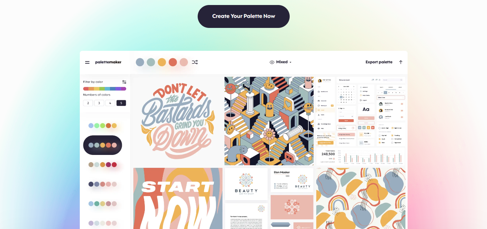

# USEFUL WEBSITES TO CHOOSE COLOR PALETTES / FONTS

---

## COLOR PALETTES

### [Adobe Colors](https://color.adobe.com/pt/)

### [Tint & Shade Generator](https://maketintsandshades.com/#AED545)

### [Color Hunt](https://colorhunt.co/palettes/)

### [Coolors](https://coolors.co/palettes/trending)

### [UI Colors](https://uicolors.app/create)

### [Realtime Colors](https://www.realtimecolors.com/?colors=050315-fbfbfe-2f27ce-dedcff-433bff&fonts=Inter-Inter)

### [Palette Maker](https://palettemaker.com/)

---

## FONTS

### [Adobe Fonts](https://fonts.adobe.com/)

### [Fonts In Use](https://fontsinuse.com)

### [Typewolf](https://www.typewolf.com/)

### [Psychology Of Fonts](https://www.crazyegg.com/blog/psychology-of-fonts-infographic/)

---

### If you have any other suggestions of websites just make a pull request :wink:

